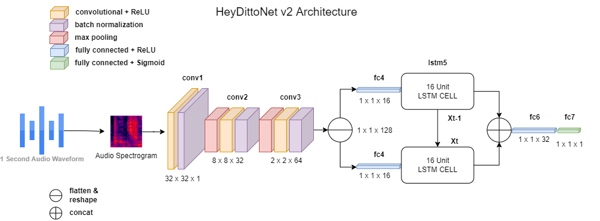
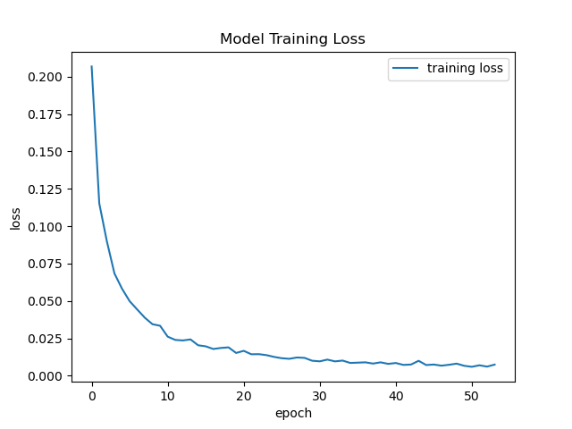

# ditto-activation
Spoken "Hey Ditto" activation using CNN-LSTM model. Model trained on both synthetic and real human voices along with samples of background noise from various scenes around the world. 

## Getting Started
1. Install required packages: `pip install -r requirements.txt`
2. Run: `python main.py` to test activation on your default mic. 

## Model Architecture
1. CNN-LSTM model architecture below with 99% testing accuracy on roughly 30,000 audio samples:

## Training Metrics
1. CNN-LSTM Training Loss:

