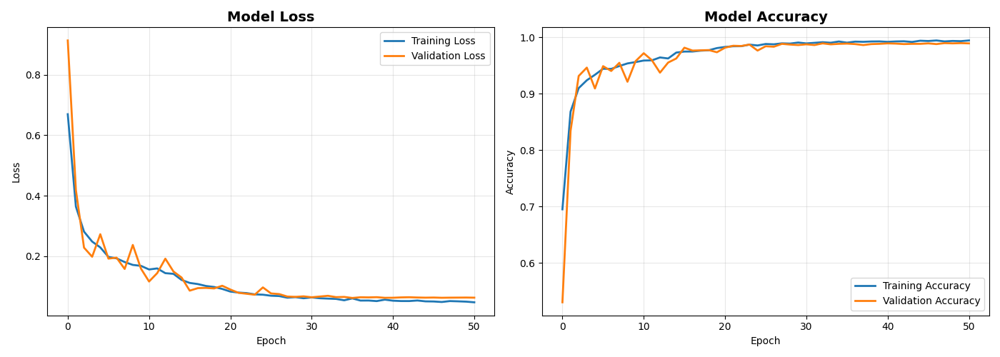
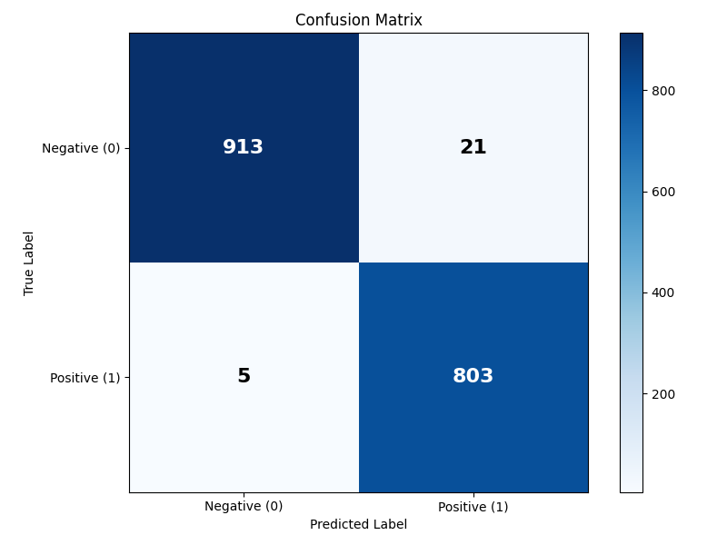

# HeyDittoNet v3

"Hey Ditto" wake word detection using a CNN with Squeeze-and-Excitation (SE) attention blocks. Trained on synthetic TTS voices (Edge, ElevenLabs, OpenAI) with extensive data augmentation.

## Model Performance

**98.5% accuracy | 99.4% recall | 0.62% false negative rate**

### Training Curves



### Confusion Matrix



## Architecture

**HeyDittoNet v3** — 54K trainable parameters

- Input: 1.5s audio (24,000 samples at 16kHz) → log mel filterbank (149 frames x 32 filters)
- Resizing layer (40x40) + Normalization
- 4x Depthwise Separable Conv + BatchNorm + SE Attention blocks
- Global Average Pooling → Dense head → Sigmoid output

Feature extraction matches `python_speech_features.logfbank(nfilt=32)`:
- 25ms frames, 10ms hop, NFFT=512
- Pre-emphasis (0.97), rectangular window
- 32 mel-scale triangular filterbanks

## Quick Start

```bash
# Setup
python -m venv .venv && source .venv/bin/activate
pip install -r requirements.txt

# Download background noise (ESC-50 + synthetic)
python src/data/download_backgrounds.py

# Generate TTS samples
python src/data/generate_samples.py --mode edge --count 500
python src/data/generate_samples.py --mode elevenlabs --count 200
python src/data/generate_samples.py --mode openai --count 200

# Create augmented dataset
python src/data/create_data.py

# Train
python src/train.py

# Evaluate
python src/test.py
```

## Project Structure

```
src/
├── model.py                  # HeyDittoNet v3 architecture
├── train.py                  # Training pipeline (150 epochs, patience=15)
├── test.py                   # Evaluation, ROC curves, threshold analysis
├── inference.py              # Real-time HeyDittoDetector class
├── export_tfjs.py            # Export to TensorFlow.js graph model
├── prune.py                  # Post-training dataset pruning tool
├── data/
│   ├── generate_samples.py   # TTS generation (Edge/ElevenLabs/OpenAI)
│   ├── create_data.py        # Dataset creation + augmentation pipeline
│   ├── download_backgrounds.py  # ESC-50 + synthetic noise generation
│   └── dataset_stats.py     # Dataset statistics
└── utils/
    ├── audio_utils.py        # Audio loading, normalization
    ├── spec_utils.py         # Log mel filterbank extraction
    └── augmentation.py       # Pitch shift, noise, SNR mixing
```

## Data Pipeline

### TTS Providers
| Provider | Positive | Negative | Cost |
|----------|----------|----------|------|
| Edge TTS (free) | ~800 | ~1,000 | $0 |
| ElevenLabs | ~300 | ~300 | ~$5-8 |
| OpenAI TTS | ~300 | ~300 | ~$0.50 |
| ESC-50 + synthetic | -- | ~500+ | $0 |

### Augmentation
- SNR mixing at 3/5/10/15/20 dB with background noise
- Pitch shifting, time stretching
- Additive noise (Gaussian, colored)
- Downsampling simulation
- 60% positive augmentation, 50% negative augmentation

Generates ~17,000+ samples from ~4,800 raw recordings.

## Pruning Tool

Identify and remove confusing samples after training:

```bash
python src/prune.py                     # Analyze and print report
python src/prune.py --listen            # Play and review each flagged sample
python src/prune.py --delete            # Move flagged samples to data/quarantine/
python src/prune.py --export report.csv # Export analysis to CSV
```

Pruned samples are moved to `data/quarantine/` (recoverable, not permanently deleted).

## TensorFlow.js Export

Export for use in the [Hey Ditto Desktop App](https://github.com/ditto-assistant/hey-ditto-realtime-desktop):

```bash
python src/export_tfjs.py
```

Produces a tfjs graph model in `models/HeyDittoNet-v3-tfjs/` (~263 KB). Load with:

```javascript
const model = await tf.loadGraphModel('file://path/to/model.json');
const prediction = model.execute(inputTensor);
```

## Real-Time Inference

```python
from src.inference import HeyDittoDetector

detector = HeyDittoDetector(model_path="models/HeyDittoNet-v3.keras")

# Feed 16kHz audio chunks continuously
if detector.process_audio(audio_chunk):
    print("Hey Ditto detected!")
```

## Environment Variables

Copy `.env.example` to `.env` and set API keys for TTS providers:

```
ELEVENLABS_API_KEY=your_key_here
OPENAI_API_KEY=your_key_here
```

Edge TTS is free and requires no API key.
